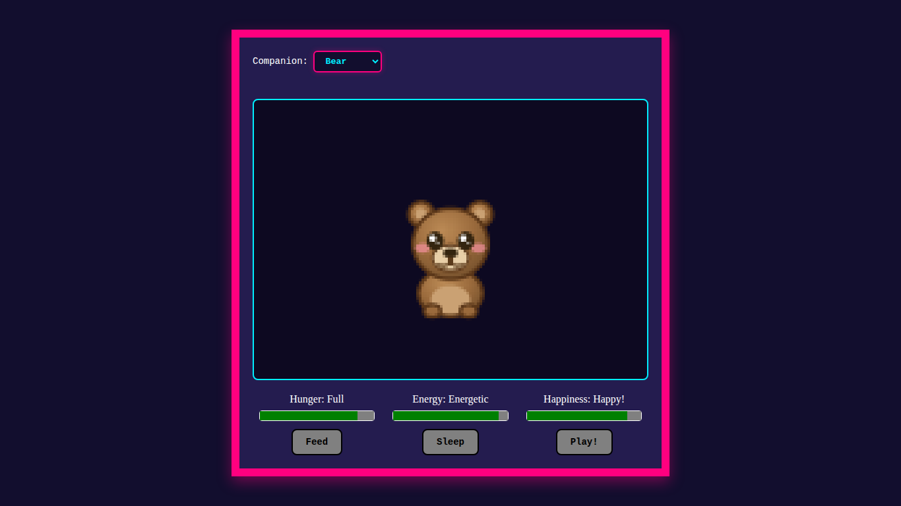
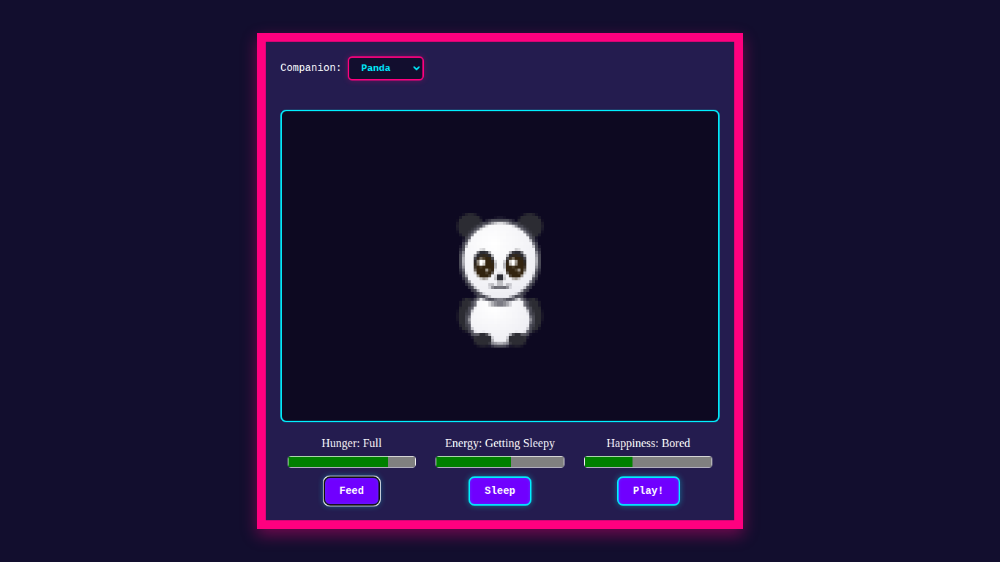

# Pipestrelle(Pip)
A cute and cozy virtual pet that lives inside your browser. Choose from various options like cat, dog, panda etc. Take lots of care of your pet or you might never be able to meet it again.

# Features
- Lots of pets inside your browser
- Feed pip
- Make pip sleep
- Play with pip
- Dont let Pip die

# Highlights
- Made using HTML5, CSS3 and vanilla JavaScript.
- Helps feel heard.
- Pixelated pets with minor animation.
- Feels like living creatures

# Image Gallery
<p align="center">


</p>

# Make your own
>It is recommended to make your own version of this virtual pet as it is very fun and teaches a lot.
1. Clone this repo with:  
```Terminal
git clone https://github.com/Zyrox-exe/Pipestrelle.git
```
2. Edit the files to add your own spices to it.
3. Open index.html in any browser.
4. To put it on the internet, go to github pages or Vercel and deploy it.

## Credits

|Asset|Link/Credit|
|----------|------------|
|Pixel Art | [Itch](https://labitos.itch.io/tiny-pets)|
|Eating Sound | [Pixabay](https://pixabay.com//?utm_source=link-attribution&utm_medium=referral&utm_campaign=music&utm_content=36186)|
|Sleeping Sound| [Pixabay](https://pixabay.com/sound-effects/people-snoring-8486/)|
|Play Sound| [Pixabay](https://pixabay.com/sound-effects/people-yay-6120/)|
|Music|[Team Salvato](https://www.youtube.com/@TeamSalvato)/[Itch](https://teamsalvato.itch.io/)|

---
<footer>Made by Mohd Sadiq Umar</footer>